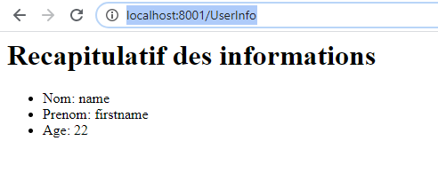

## TPs 4 & 5 (JPA + Servlets)

### Remarques!!!

- Ayant des soucis avec eclipse, j'ai travaillé avec IntelliJ pendant ce TP.

- Il faut travailler avec le JDK13 pour lancer l'apllication.

### TP 4

**Questions 0, 1, 2, 3, 4 :** regarder le projet

**Question 5 :** regarder l'étape 8 du TP 5 

**Question 6 :**

Technique n1select: 

Technique joinfetch: 

En comparant les deux techniques, nous appercevons que la technique n1select prend beaucoup plus de temps et réalise beaucoup plus de requêtes que la technique joinFetch, cela veut dire que joinFetch est plus performante.

### TP 5

**Questions 1 :** regarder le projet

**Question 6 parties a,b,c :** regarder le projet

### Etapes:

Veuillez mettre le contexte à vide dans IntelliJ pour ne pas spécifier à chaque fois le répertoire de déploiment

**Etape 0 :** lancer run-hsqldb-server.bat pour lancer la base de données

**Etape 1 :** Lancer la classe \src\main\java\jpa\JpaTest.java

**Etape 2 ( Question 2 TP 5 ) :** lancer l'application sur le port 8001 en utilisant IntelliJ ( j'avais des problèmes avec le port 8080 ) 

 
**Etape 3 ( Question 3 TP 5 ) :** aller sur `localhost:8001/myurl`

**Etape 4 ( Question 4 TP 5 ) :** aller sur le lien `localhost:8001/myform.html`, remplir le formulaire et l'envoyer pour récapituler les informations

**Etape 5 ( Question 5 TP 5 ):** aller sur le lien `localhost:8001/ajoutEmployee`, ajouter un employee et un département, puis envoyer le formulaire pour afficher la liste des employés ainsi que leurs départements

**Etape 6 ( Question 6 parties d et e ):** aller sur le lien `localhost:8001/rest/hello`

aller sur le lien `localhost:8001/rest/hello/home`

**Etape 7 ( Question 7 TP 5 ):** développement de deux services rest, un qui permet d'ajouter un employé et autre qui permet de récuperer la liste des employés.

`localhost:8001/rest/employees/add` type post:

`localhost:8001/rest/employees/list` type get:

**Etape 8 ( Question 5 TP 4 ) :** Pour la partie gestion de l'héritage, j'ai crée une classe SondageFils qui hérite d'une classe SondagePrincipale, ceci m'a généré avec JPA une table dans la base de données appelée sondagePrincipal qui contient les champs des deux classes.

Voilà le résultat d'une requete postman sans et avec paramètres, ces résultats sont fournies en utilisant les **criteria query** de java:

**première requete :** on ne passe pas de paramètres ça va nous retourner tous les sondages : `localhost:8001/rest/sondages`

**deuxième requete :** on resngeine juste un seul paramètre lieu= rennes : `localhost:8001/rest/sondages?lieu=Rennes`

**troisième requete :** on passes deux paramètres intitule= sondageFils0 et lieu = rennes : 

`localhost:8001/rest/sondages?intitule=sondageFils0&lieu=Rennes`

## TP 7 ( partie Angular )

### Etapes

**Etape 0 :** lancer l'application TP4&5 sur le port 8001

**Etape 1 :** lancer la commande `npm install` dans le répértoire **TP7**

**Etape 2 :** lancer angular avec `ng serve` dans le répértoire **TP7**

**Etape 3 :** aller sur le lien `localhost:4200` ( J'ai ajouté le fichier proxy.config.conf pour éviter le problème de CORS ) 

**Etape 4 :** ajouter un employé, puis cliquer sur post pour le suvegarder et ensuite cliquer sur get data pour récupérer la liste 
des employés ainsi que leurs départements

  

**Etape 5 :** Pour la partie nginx:

     -> Télécharger nginx

     -> Modifier le fichier nginx.conf avec le contenu suivant :

      worker_processes  1;

      events {

          worker_connections  1024;

      }

      http {

          include       mime.types;

          default_type  application/octet-stream;

          include path-to-your-nginx/conf/sites-enabled/*.conf;

      }

     -> Créer le répértoire conf/sites-enabled 

     -> Créer le fichier angular-java.conf dans le répértoire conf/sites-enabled et y ajouter le contenu suivant:

     server {

     server_name  localhost;

     listen 80;

     root local_path/TP_BackendJPA_Frontend/TP7/dist/angularProject;

     location /rest {

         proxy_set_header X-Forwarded-Host $host;

         proxy_set_header X-Forwarded-Server $host;

         proxy_set_header X-Forwarded-For $proxy_add_x_forwarded_for;

         proxy_pass http://localhost:8001;

    }
    }
      
**local_path**: chemin vers l'endroit ou vous avez cloné le projet

**path-to-your-nginx**: chemin où vous avez installé nginx
    
**Etape 6 :** lancer le build angular en mode production avec la commande **ng build --prod** ( cela va générer le répértoire des fichiers de l'application dans "dist/angularProject" )

**Etape 7 :** aller à la racine nginx et lancer nginx avec la commande **start nginx**

**Etape 8 :** aller sur l'url `localhost` sans spécifier le port vue que nous avons utilisé nginx

