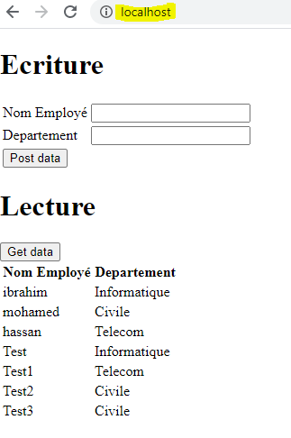

## TP 7:

### Etapes

**Etape 0 :** lancer l'application TP4&5 sur le port 8001

**Etape 1 :** lancer la commande `npm install` dans le répértoire **TP7**

**Etape 2 :** lancer angular avec `ng serve` dans le répértoire **TP7**

**Etape 3 :** aller sur le lien : localhost:4200 ( J'ai ajouté le fichier proxy.config.conf pour éviter le problème de CORS ) 

**Etape 4 :** ajouter un employé, puis cliquer sur post pour le suvegarder et ensuite cliquer sur get data pour récupérer la liste 
des employés ainsi que leurs départements

  

**Etape 5 :** Pour la partie nginx:

     -> Télécharger nginx

     -> Modifier le fichier nginx.conf avec le contenu suivant :

      worker_processes  1;

      events {

          worker_connections  1024;

      }

      http {

          include       mime.types;

          default_type  application/octet-stream;

          include path-to-your-nginx/conf/sites-enabled/*.conf;

      }

     -> Créer le répértoire conf/sites-enabled 

     -> Créer le fichier angular-java.conf dans le répértoire conf/sites-enabled et y ajouter le contenu suivant:

     server {

     server_name  localhost;

     listen 80;

     root local_path/TPs_MDI_AL/TP7/dist/angularProject;

     location /rest {

         proxy_set_header X-Forwarded-Host $host;

         proxy_set_header X-Forwarded-Server $host;

         proxy_set_header X-Forwarded-For $proxy_add_x_forwarded_for;

         proxy_pass http://localhost:8001;

    }
    }
      
**local_path**: chemin vers l'endroit ou vous avez cloné le projet

**path-to-your-nginx**: chemin où vous avez installé nginx
    
**Etape 6 :** Lancer le build angular en mode production avec la commande **ng build --prod** ( cela va générer le répértoire des fichiers de l'application dans "dist/angularProject" )

**Etape 7 :** Aller à la racine nginx et lancer nginx avec la commande **start nginx**

**Etape 8 :** Aller sur l'url localhost sans spécifier le port vue que nous avons utilisé nginx

