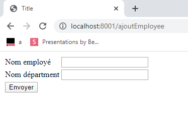

## TPs 4 & 5

### Remarques!!!

- Ayant des soucis avec eclipse, j'ai travaillé avec IntelliJ pendant ce TP.

- Il faut travailler avec le JDK13 pour lancer l'apllication.

### Etapes:

Veuillez mettre le contexte à vide dans IntelliJ pour ne pas spécifier à chaque fois le répertoire de déploiment

**Etape 0 :** lancer run-hsqldb-server.bat pour lancer la base de données

**Etape 1 :** Lancer la classe \src\main\java\jpa\JpaTest.java

**Etape 2 :** lancer l'application sur le port 8001 en utilisant IntelliJ ( j'avais des problèmes avec le port 8080 )
 
**Etape 3 :** aller sur le lien localhost:8001/ajoutEmployee

**Etape 4 :** ajouter un employee et un département, puis envoyer le formulaire pour afficher la liste des employés ainsi que leurs départements

**Etape 5 :** Pour la partie gestion de l'héritage: j'ai crée une classe SondageFils qui hérite d'une classe SondagePrincipale, 

ceci m'a généré avec JPA une table dans la base de données appelée sondagePrincipal qui contient les champs des deux classes.

Voilà le résultat d'une requete postman sans et avec paramètres, ces résultats sont fournies en utilisant les criteria query de java:

**première requete :** on ne passe pas de paramètres ça va nous retourner tous les sondages : localhost:8001/rest/sondages

**deuxième requete :** on resngeine juste un seul paramètre lieu= rennes : localhost:8001/rest/sondages?lieu=Rennes

**troisième requete :** on passes deux paramètres intitule= sondageFils0 et lieu = rennes : 

localhost:8001/rest/sondages?intitule=sondageFils0&lieu=Rennes

